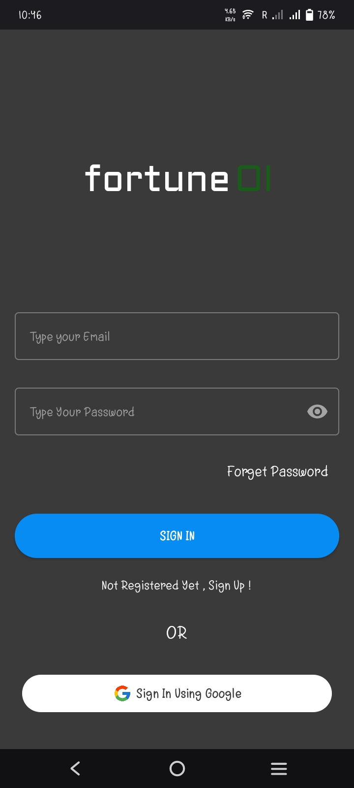
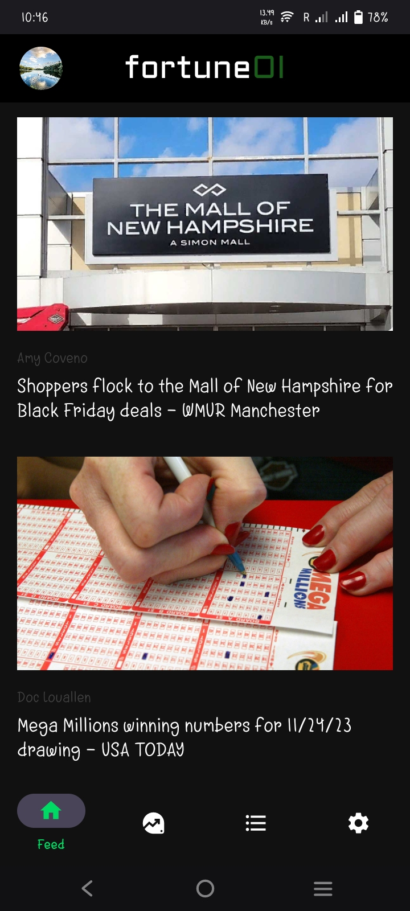
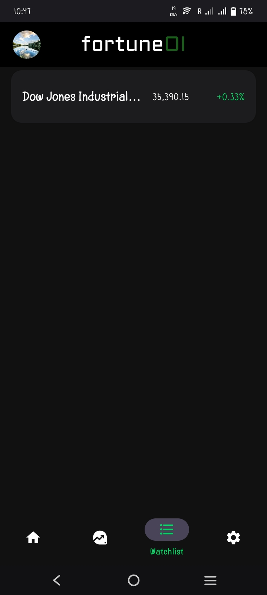
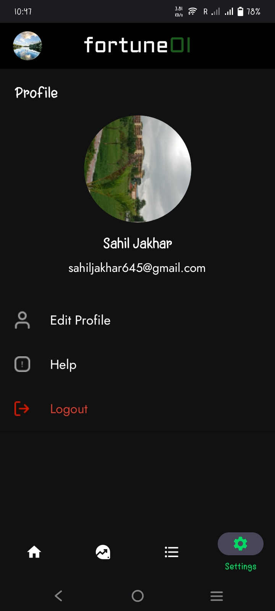

# Fortune OI

Fortune OI is a robust stock market application designed to provide users with real-time market data, custom watchlist management, and insightful analytics. Built with a focus on simplicity and functionality, it integrates modern technologies for seamless user experiences.

## Features
- **Real-time Stock Data**: Fetch and display live stock data using the Yahoo Finance API.
- **Custom Watchlists**: Create and manage personalized watchlists.
- **Graphical Insights**: Visualize stock trends using interactive graphs powered by a third-party library.
- **Secure Authentication**:
  - Google Sign-In
  - Email-based authentication
- **Personalized Storage**: Store and retrieve user-specific preferences and watchlists securely using Firebase Firestore.

## Technologies Used
- **Frontend**: Kotlin and Jetpack Compose for building an intuitive user interface.
- **Backend Services**: Firebase for authentication and data management.
- **API Integration**: Yahoo Finance API for live stock market data.
- **Graphs & Charts**: Third-party libraries for rendering dynamic and interactive stock graphs.

## Screenshots

### Login Page


### Register Page


### Home Page


### News Page


### Fii- Dii Data Page


### Stock Data Page


### WatchList Page


### Profile Page


### Search Details Page


## Installation

### Prerequisites
- Android Studio installed on your system.
- A valid Firebase project is configured with authentication and Firestore.
- API key for Yahoo Finance.

### Steps
1. Clone the repository:
   ```bash
   git clone https://github.com/Sahil270403/Fortune-OI.git

2. Open the project in Android Studio.
   
3. Configure the Firebase project by adding the google-services.json file to the app directory.
   
4. Add your Yahoo Finance API key in the respective configuration file.
 
5. Build and run the project on your emulator or Android device.
